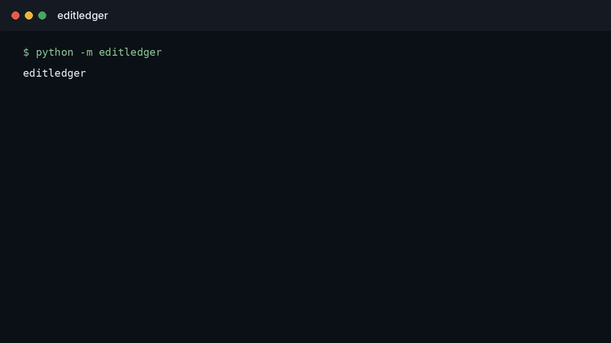

<div align="center">

# editledger

**A lineage record for an edited line that a later reader can tell has not been quietly rewritten.**

[](LICENSE)

**Status:** runnable on designed examples. Not a clinical system, a LIMS, or a trained model.

</div>

---

## Watch

<p align="center">
  
</p>

The clip is the working screen: the chain holds, then a rewritten guide breaks it. [Open the demo](docs/demo.html). [Full video](docs/demo.mp4).

## The problem

Ask where a cell line came from and the answer is often a spreadsheet, a slide, and someone's memory of which parental stock was used. The guide, the editor, the parental vial, the clone pick, and the passage at edit time get separated. Six months later the record can be tidied without anyone being able to see the tidy.

A lineage that matters has two properties. It names the objects that were actually used. It makes a silent edit to that history detectable.

## The record I would trust

Each event is an append. Nothing in the past is updated in place.

| Event | What it must bind |
| --- | --- |
| Parental stock | Vial or lot, not a nickname alone |
| Edit | Editor, guide, and the sequence or identifier used that day |
| Clone pick | Which well became the line people now cite |
| Passage or bank | When the object in hand stopped being the object on the previous line |

The tamper check is simple to state: recompute the chain from the first event and see if the stored chain still matches. A PDF that can be replaced is not that check.

## What this repository is

`editledger` appends events and recomputes the chain. It is not a LIMS, and it does not store anyone's cells. Drift against a window is in [editdrift](https://github.com/TechieGoku2623/editdrift).

## Run

```bash
python3 -m venv .venv
source .venv/bin/activate
pip install -e .
python -m editledger
python -m unittest discover -s tests -v
```

## Author

**Choppa Devasai Pranatheswar** · [LinkedIn](https://www.linkedin.com/in/devasai-pranatheswar)
